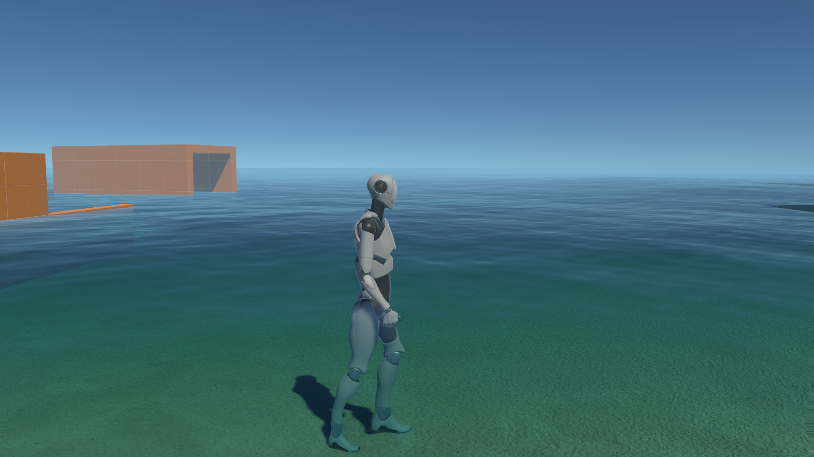

# Embodiment and Reaction Time

[SOFTENG 702 *Advanced Human–Computer Interaction*](https://courseoutline.auckland.ac.nz/dco/course/SOFTENG/702), Semester Two 2024.

This repository is part of the [Protocol and Implementation](https://canvas.auckland.ac.nz/courses/105865/assignments/399018#submit) for Project B2.

## Project background

This is the implementation for a SOFTENG 702 study, whose intention is to test whether interactions in different physical media affects participant’s reaction time. There are two scenes—one in **air** and one in **water**—which simulate the physical properties of these media.

This code is accompanied by a [user study protocol](https://docs.google.com/document/d/1mpcQkzV3XXXwH2mWLcpXabVgCbIsed2JqPSplnRSHes).

## ✅ Prerequisites

To run the Unity project, you’ll need:

- A system capable of running a (relatively simple) Unity project.
- **[Unity](https://unity.com/download), with an active [Unity plan](https://unity.com/products).** This includes [Unity Hub](https://unity.com/unity-hub) and Unity Editor version 2020.3.28. If you’re a student, you’re probably eligible for the free [Unity Student Plan](https://unity.com/products/unity-student).

## 🖱️ Set-up and run

1. Clone this repo and open the project root with Unity Hub. (**Projects** tab → **Add** → **Add project from disk**.)
1. Once the Unity Editor has loaded in Unity Hub, click **Open** open it with Unity Editor.
1. Navigate to the `Scenes/` subfolder, and select either the **Air** or **Water** scene.

<!-- 👷 Insert runtime information here 🚧 -->

## 🗃️ Project structure

- [`Assets/`](/Assets/): Contains all game objects, scripts, and resources.

<!-- 
- Scenes: Houses the two primary scenes: `Grass` and `Water`.
- Scripts: Contains the core logic for interacting with the environments.
- Prefabs: Pre-configured game objects that can be reused across scenes. 
-->

## 🎬 Scenes

- **Air Scene**. Simulates a normal walking environment, with no restrictions on movement speed or acceleration.
- **Water Scene**. Simulates a waterlogged environment, with distinct visual and reduced movement speed.

